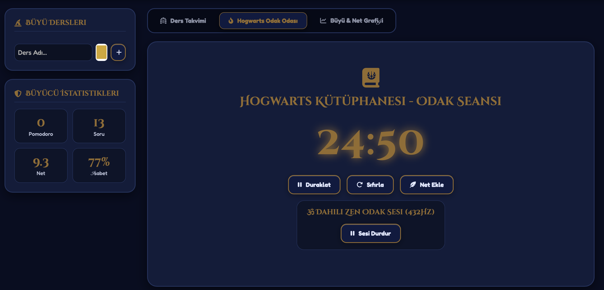
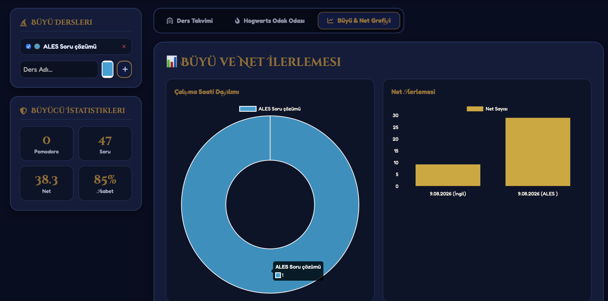
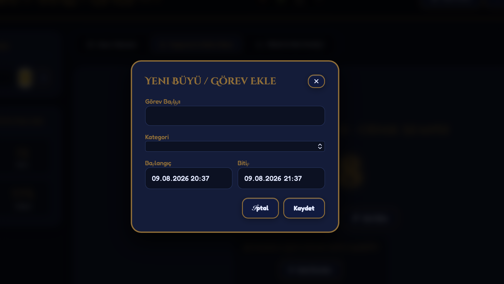

# 🧙‍♂️ Hogwarts & Minecraft Smart Event Planner

> **Hogwarts ve Minecraft estetiğiyle tasarlanmış, büyülü asa efektleri, bina temaları, Pomodoro odak zamanlayıcısı ve sınav net takip modülü içeren web tabanlı akıllı etkinlik ve ders planlayıcısı.**

---

## ⚡ Canlı Önizleme & Demo
👉 **[Web Sitesini Canlıda Dene](https://manolyadusgun.github.io/hogwarts-smart-planner/)**

---

## 📸 Ekran Görüntüleri

| Ders Takvimi & Bina Seçici | Hogwarts Odak Odası |
| :---: | :---: |
|  |  |

| Büyücü İstatistikleri & Grafik | Net & Soru Takibi |
| :---: | :---: |
|  |  |

---

## ✨ Öne Çıkan Özellikler

* **🪄 Etkileşimli Büyülü Asa Efekti:** Ekrana her tıklandığında Canvas üzerinde parıldayan altın, gümüş ve elmas yıldız simleri (sparkles).
* **🏰 Hogwarts Bina Temaları:** Gryffindor, Slytherin, Ravenclaw ve Hufflepuff binalarına özel anında değişen dinamik renk paletleri.
* **📅 Gelişmiş Ders Takvimi:** FullCalendar entegrasyonu ile aylık, haftalık, günlük ders/etkinlik planlama ve sürükle-bırak desteği.
* **⏱️ Pomodoro Odak Zamanlayıcısı:** Ders çalışma seansları ve mola uyarıları.
* **🎵 432Hz Zen Odak Sesi:** Web Audio API ile tarayıcı içinden anlık sentezlenen odaklanma tonu.
* **🎯 Soru & Net Hesaplayıcı:** Sınav hazırlıkları (ALES, YÖKDİL vb.) için doğru/yanlış sayılarına göre otomatik net hesaplama (4 yanlış = 1 doğru).
* **📊 Analiz Dashboard'u:** Chart.js grafikleri ile ders bazlı çalışma saatleri ve haftalık net ilerleme takibi.
* **📆 iCal Export:** Tüm etkinlikleri Apple Calendar veya Google Calendar'a `.ics` formatında aktarma imkanı.
* **💾 LocalStorage Desteği:** Sayfa yenilense bile tüm verilerin tarayıcıda saklanması.

---

## 🛠️ Kullanılan Teknolojiler

* **HTML5 / CSS3** (Custom Properties, Glassmorphism, Flexbox & Grid)
* **Vanilla JavaScript** (ES6+)
* **Web Audio API** (Dahili Ses Sentezleyici)
* **HTML5 Canvas** (Parçacık/Sim Efektleri)
* **FullCalendar v6**
* **Chart.js**
* **FontAwesome v6**

---

## 💻 Kurulum ve Çalıştırma

Proje tamamen bağımsız (Client-Side) bir yapıdadır. Herhangi bir paket yüklemesi (`npm install`) gerektirmez.

1. Depoyu klonlayın:
   ```bash
   git clone [https://github.com/ManolyaDusgun/hogwarts-smart-planner.git](https://github.com/ManolyaDusgun/hogwarts-smart-planner.git)
